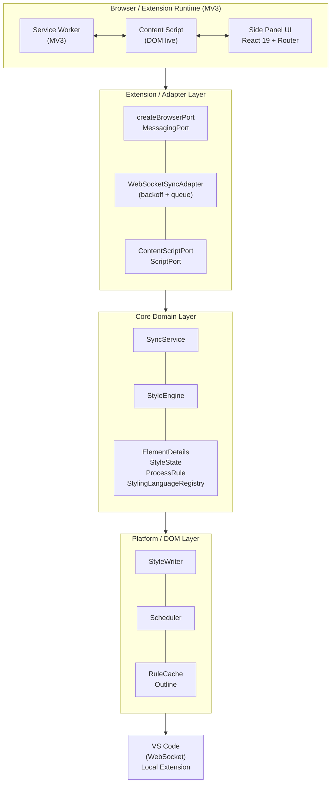

# TweakSync — Real-Time CSS Styling & VS Code Sync

**TweakSync** is a Manifest V3 Chrome extension that lets front-end developers style any live DOM element in real time inside the browser and instantly sync those CSS changes to VS Code over a local WebSocket. It eliminates the manual copy-paste loop between DevTools and editor, keeping browser tweaks and source code perfectly aligned.


---

## The Problem

Modern front-end development requires constant back-and-forth between the browser and the code editor:

1. **DevTools friction** — Inspecting an element, tweaking a CSS value, and copying it back to the source file is slow and error-prone.
2. **Context switching** — Every style change breaks flow: Alt+Tab, find the file, paste, save, Alt+Tab back.
3. **No live sync** — Even with hot reload, there is no bridge between what you visually tweak in the browser and what lands in your editor.
4. **Cross-browser inconsistency** — Tools that work in Chrome often fail or need duplication for Edge or Firefox.

---

## The Solution

TweakSync turns the browser itself into a live style editor with a **React side panel** that:

- **Lets you click any element** on a live page to inspect and edit its attributes and styles.
- **Applies changes instantly** to the DOM with throttled, batched writes to avoid layout thrash.
- **Syncs the result** to a local VS Code extension over a managed WebSocket with exponential backoff reconnection and a bounded send queue.

Because the core logic is isolated from the browser runtime, the same codebase produces installable packages for **Chrome, Edge, and Firefox**.

---

## Architecture

TweakSync is built on **Clean Architecture / SOLID** principles. Browser APIs are isolated behind adapter/port interfaces so the domain logic stays framework-agnostic, testable, and portable.



### Layer Responsibilities

| Layer | Path | Responsibility |
|-------|------|----------------|
| Domain / Core | `src/core` | Pure business logic (element model, styling engine, `SyncService`, `StylingLanguageRegistry`). No React, no `chrome.*`, no DOM. |
| Ports | `src/ports` | TypeScript interfaces: `BrowserPort`, `MessagingPort`, `StoragePort`, `ContentScriptPort`, `SyncTransportPort`. |
| Adapters | `src/adapters/browser`, `src/adapters/memory` | The only layer that touches browser APIs (via `webextension-polyfill`); `memory` holds in-memory test doubles. |
| UI | `src/ui`, `src/components`, `src/pages` | Platform-independent React; receives capabilities via injected ports, never calls browser APIs directly. |
| Platform | `src/platform/dom` | Reusable pure script modules (DOM writers, scheduler, selector sheet, outline overlay). |
| Extension | `src/extension` | Composition root (`composition.ts`) that wires ports → adapters and binds the side-panel / service-worker runtime. |

### Key Contracts and Flow

1. **User clicks element in page** -> content script (`src/extension/content.ts`) captures
   the click, extracts element details via `getElementDetails()` (core), and sends
   `{ action: "elementClicked", details }` to the side panel through `BrowserPort.messaging`.

2. **Side panel receives element** -> React pages (`ElementInspector.tsx`, `StyleInspector.tsx`)
   render the element's attributes and styles using factory/facade components.

3. **User edits a style** -> UI dispatches a message through `BrowserPort.messaging` ->
   service worker (`src/extension/serviceWorker.ts`) -> forwarded to content script ->
   `applyStyleUpdate()` in `src/platform/dom/styleWriter.ts` writes to the DOM, batched
   via `createFrameScheduler()` (rAF coalescing).

4. **User syncs to VS Code** -> `SyncService.sendStyleEdit()` serializes declarations
   via `serializeStyles.ts` -> `WebSocketSyncAdapter.send()` ships the payload over
   WebSocket with bounded queue + exponential backoff reconnection.

---

## Tech Stack

| Concern | Choice |
|---------|--------|
| Language | TypeScript (strict, `target: ES2020`) |
| Bundler | Vite 8 (`vite.config.ts`) |
| UI | React 19 + React Router 7 |
| Styling | Tailwind CSS 4 + `tailwindcss-animate`, Radix UI primitives |
| Extension APIs | `chrome.*` (Manifest V3): `sidePanel`, `activeTab`, `scripting`, `storage` |
| Utilities | `clsx`, `tailwind-merge`, `class-variance-authority`, `lucide-react` |
| Testing | Vitest + Testing Library + V8 coverage |
| Cross-browser | `webextension-polyfill` (Chrome, Edge, Firefox) |

**Path alias:** `@/*` -> `./src/*` (configured in both `tsconfig.json` and `vite.config.ts`).
Always import with `@/...`, never relative `../../` chains.

---

## Features

### Real-Time Element Styling
- **Click-to-inspect**: Click any DOM element on a live page to select it for editing.
- **Live preview**: Changes are applied instantly to the page via batched DOM writes.
- **Attribute editing**: Modify HTML attributes (id, class, data-*, ARIA, etc.) with type-aware inputs.

### Comprehensive Style Editor
- **Property groups**: Styles are organized into logical groups (Text, Margin, Flex, Border, Background, etc.).
- **Shorthand support**: Longhand declarations are collapsed into shorthands (e.g., `margin-top`, `margin-right` -> `margin`).
- **Pseudo-class/element support**: Edit `:hover`, `::before`, `::after`, and other pseudo selectors.
- **At-rule support**: Edit `@media`, `@supports`, and other at-rule blocks.

### VS Code Synchronization
- **WebSocket transport**: Sync style edits to a local VS Code extension over a managed WebSocket.
- **Resilient connection**: Exponential backoff reconnection with jitter, bounded send queue with TTL.
- **Serialized CSS output**: Declarations are serialized to clean CSS text before shipping to the editor.

### Cross-Browser Support
- **Chrome, Edge, Firefox**: A single source tree produces installable packages for all three browsers.
- **WebExtensions standard**: No proprietary APIs leak into core logic; `webextension-polyfill` normalizes differences.
- **Feature detection**: Capability differences are handled via feature detection, never user-agent sniffing.

### Performance & Reliability
- **rAF coalescing**: DOM writes are batched into a single animation frame via `createFrameScheduler()`.
- **Throttled outline**: Outline updates are debounced to avoid layout thrash during scroll/resize.
- **O(1) selector index**: `getCachedRules()` provides constant-time lookup of CSSStyleRules by selector.
- **Analyzed complexity**: Core algorithms are designed with explicit Big O bounds; no quadratic behavior on user-driven input.

---

## How It Works

### 1. Install
```bash
# Clone the repo
git clone https://github.com/yourusername/TweakSync.git
cd TweakSync

# Install dependencies
npm install

# Build the extension
npm run build
```

### 2. Load in Chrome
1. Open `chrome://extensions/`
2. Enable **Developer mode**
3. Click **Load unpacked** and select the `dist/chrome` folder

### 3. Use
1. Click the TweakSync icon or press `Ctrl+Shift+S` (Cmd+Shift+S on Mac) to open the side panel.
2. Press `Ctrl+Shift+E` to start editing mode on the current page.
3. Click any element on the page to inspect it.
4. Edit styles or attributes in the side panel. Changes apply instantly.
5. Press `Ctrl+Shift+Z` to connect to VS Code, then sync your edits.

### Keyboard Shortcuts

| Shortcut | Action |
|----------|--------|
| `Ctrl+Shift+S` / `Cmd+Shift+S` | Open TweakSync side panel |
| `Ctrl+Shift+Z` / `Cmd+Shift+Z` | Connect to VS Code |
| `Ctrl+Shift+E` / `Cmd+Shift+E` | Start editing mode |
| `Ctrl+Shift+X` / `Cmd+Shift+X` | Stop editing mode |
| `Escape` | Clear current selection |

---

## Technical Highlights

### Clean Architecture in Practice

The project enforces strict inward dependencies:

- **Core layer** (`src/core/`) contains all business logic but imports zero browser or UI modules.
- **Ports** (`src/ports/`) define contracts; **adapters** (`src/adapters/`) implement them.
- **Platform layer** (`src/platform/dom/`) handles DOM mutations but stays framework-free.
- **Extension layer** (`src/extension/`) is the single composition root that wires everything together.

### SOLID at Every Level

| Principle | Example |
|-----------|---------|
| **Single Responsibility** | `SyncService` orchestrates sync; `serializeStyles.ts` handles serialization; `styleEngine.ts` applies updates. |
| **Open/Closed** | New style groups are added by registering through `StyleFactory.tsx` + `styleFacade.ts` without editing core renderers. |
| **Liskov Substitution** | `MemorySyncTransportPort` satisfies the same `SyncTransportPort` contract as `WebSocketSyncAdapter`. |
| **Interface Segregation** | Browser APIs are split into small ports: `StoragePort`, `MessagingPort`, `TabsPort`, etc. |
| **Dependency Inversion** | `SyncService` depends on `SyncTransportPort`, not on `WebSocketSyncAdapter` directly. |

### Performance-Conscious Design

- **O(updates) style application**: `applyStyleUpdates()` uses a single Map lookup per update. No nested element x rule iteration.
- **O(d + k log k) shorthand processing**: `processRule()` only considers shorthands that own declared longhands, then sorts a small candidate set.
- **rAF write coalescing**: `createFrameScheduler()` batches DOM writes into one animation frame per tick.
- **Debounced outline**: `throttle.ts` ensures outline overlay updates do not fire more than once per 50ms.
- **O(1) selector index**: `getCachedRules()` maintains a selector-to-CSSStyleRule map for instant lookups.

### Testability-First

- **Unit tests**: Core domain logic is tested without a DOM or browser runtime.
- **Integration tests**: Cross-layer contracts (messaging, storage, sync flow) are verified end-to-end.
- **Memory adapters**: `src/adapters/memory/` provides in-memory test doubles for all ports.
- **Coverage gate**: Vitest enforces 80% coverage on `src/core`; the build fails below this threshold.

---

## Cross-Browser Build

The extension can be built for Chrome, Edge, and Firefox from the same source tree:

```bash
npm run build:chrome    # Chrome package
npm run build:edge      # Edge package
npm run build:firefox   # Firefox package
npm run build:all       # All three
```

Each build targets a separate `dist/` subfolder with a browser-appropriate `manifest.json`.
Differences in extension APIs (storage, scripting, side panel) are reconciled behind the
`BrowserPort` abstraction using `webextension-polyfill`.

---

## Future Roadmap

- **Additional styling languages**: Sass, Less, and Tailwind support via the `StylingLanguageRegistry` extension point.
- **Multi-element sync**: Sync style edits across multiple matched elements simultaneously.
- **CSS selector builder**: Visual selector construction from the inspected element's ancestry.
- **History & undo**: Track style changes with undo/redo support.
- **VS Code protocol v2**: Richer payloads (nested selectors, source maps, comments).

---

## License

Private / Proprietary Software

© 2026 Mohamedhazeem. All rights reserved.

This software is proprietary and confidential. Unauthorized copying, modification,
distribution, or use of this software, in whole or in part, is strictly prohibited
without explicit written permission from the copyright holder.

See [license.md](license.md) for full terms.

---

Built with [React](https://react.dev), [TypeScript](https://www.typescriptlang.org), [Tailwind CSS](https://tailwindcss.com), [Radix UI](https://www.radix-ui.com), and [Vite](https://vitejs.dev).
